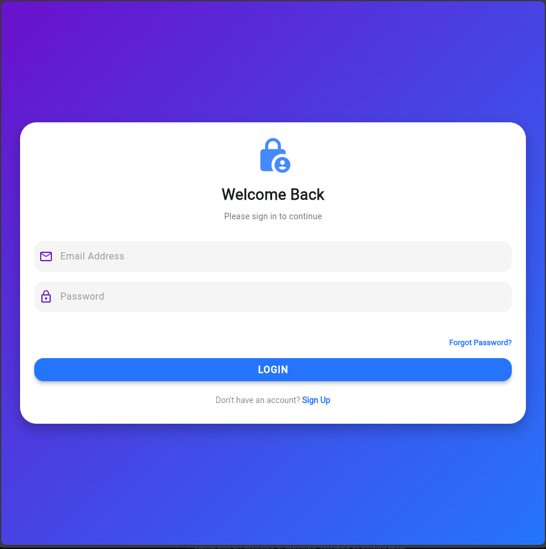
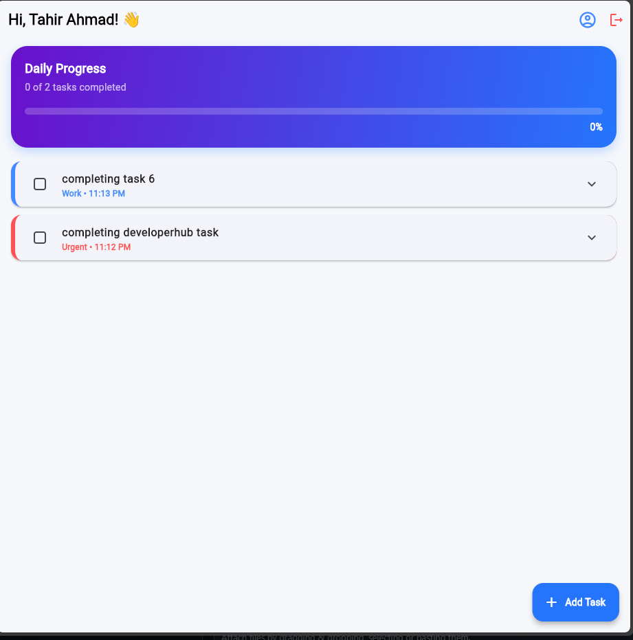
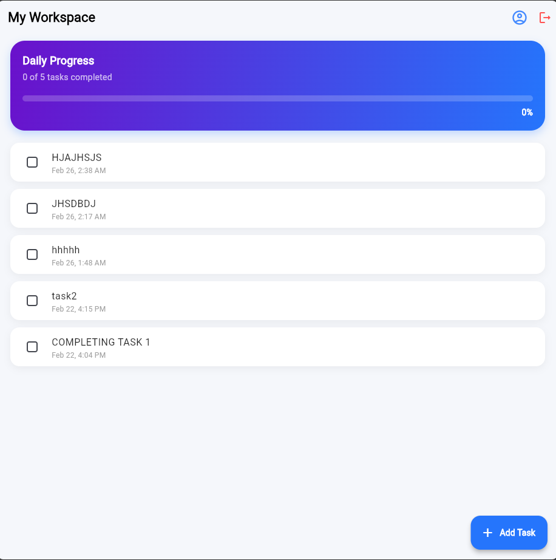
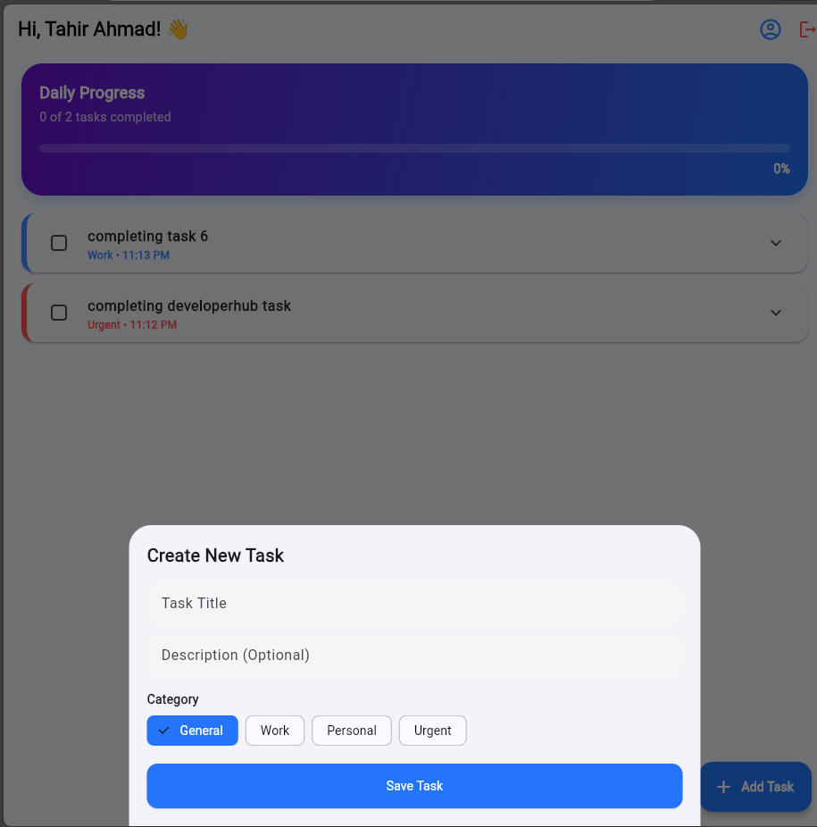

# 🚀 TaskFlow - Premium Task Management App

A sleek, functional, and high-performance task management application built with **Flutter** and **Firebase**. This app is designed with a focus on visual hierarchy, real-time data synchronization, and a premium user experience.

---

## 📱 App Walkthrough

### 1. Welcome & Access
| Splash Screen | Login / Sign Up |
|---|---|
|  |  |
| *Branded entry experience* | *Secure Firebase Authentication* |

### 2. The Dashboard
| Home Screen | Task Details (Expanded) |
|---|---|
|  |  |
| *Real-time progress tracking with dynamic gradients* | *Tap any task to reveal descriptions and edit options* |

### 3. Adding Tasks
| Task Entry Form |
|---|
|  |
| *Premium Bottom Sheet with Category Selection (Urgent, Work, Personal)* |

---

## ✨ Core Features
* **Authentication:** Secure user onboarding using Firebase Auth.
* **Real-time Firestore Sync:** Your tasks are updated instantly across all devices.
* **Intelligent Categorization:** Color-coded vertical bars for instant priority recognition.
    * 🔴 **Urgent**
    * 🔵 **Work**
    * 🟢 **Personal**
* **Progress Analytics:** A dynamic header card that calculates your daily completion percentage.
* **Gestural Interaction:** Swipe-to-delete functionality for a modern feel.
* **Detailed Planning:** Add descriptions to tasks and toggle them with smooth expansion animations.

---

## 🛠️ Technical Setup

### Prerequisites
* Flutter SDK (3.x or higher)
* Dart 3.0+
* A Firebase Project

### Installation
1. **Clone the repo:**
   ```bash
   git clone [https://github.com/Tahirahmad1002/task_managment_app.git](https://github.com/Tahirahmad1002/task_managment_app.git)
